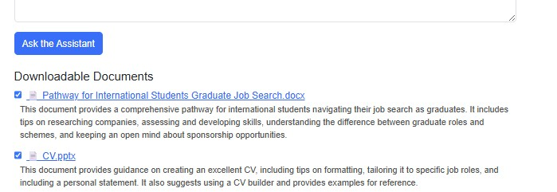

# Embedding Assistant

The Embedding Assistant is an AI-powered web application designed to support academic staff at the University of Greenwich in embedding employability skills and resources into their teaching. It enables users to query a custom knowledge base of documents and career development pathways, receiving intelligent suggestions along with direct download links.

---

## 🌟 Key Features

- **Semantic Document Search**: Uses FAISS and OpenAI embeddings to retrieve documents relevant to user queries.
- **LLM-Generated Summaries**: Provides concise, AI-generated summaries of each document for quick previewing.
- **Smart General Document Inclusion**: Ensures that general-purpose materials (e.g. CV templates) are always shown, even during subject-specific searches.
- **Tag Detection**: Automatically detects and stores useful tags like `general` and `main` for use in filtering and inclusion logic.
- **Pathway Matching**: Recommends career development pathways from Target Connect using semantic similarity.
- **Download as ZIP**: Users can select documents and pathways to download as a single `.zip`. When pathways are included, the archive also contains a `pathways.txt` summary file.
- **Higher Education Level Dropdown**: Academic level input now reflects HE levels 4, 5, 6, and 7.
- **Loading Spinner**: Shows a visual spinner when the assistant is processing.
- **Traditional Layout**: Simplified, accessible front-end designed for ease of use and clarity.

---

## 🏗 Project Structure

```
.
├── main.py                 # Flask API backend, integrates OpenAI + FAISS
├── vector_build.py        # Indexes documents, adds metadata and tags
├── pathways.json          # Pathway entries with title, description, and URL
├── build_pathway_index.py # Builds FAISS index for pathway matching
├── static/
│   └── index.html         # Front-end HTML interface
├── faiss_index/           # Vector store for documents
├── pathways_index/        # Vector store for pathways
├── resources/             # Folder for uploaded documents (via Azure Blob)
├── file_hashes.json       # Tracks document processing hashes
├── requirements.txt
└── README.md
```


---

## 🔍 How Document Search Works

1. **User Query**: Lecturers submit a structured query (Subject, Level, Module, Notes).
2. **Semantic Retrieval**: The app uses LangChain's FAISS-based retrieval to return top matches.
3. **General Files Merged**: General or main-tagged documents (e.g. CV templates) are always included.
4. **Summaries Displayed**: Short summaries are shown alongside document download links.
5. **Pathway Links**: Career-related resources from Target Connect are displayed and optionally bundled.

---

## 🏷 Tagging Logic

Documents are automatically tagged in `vector_build.py` based on filename and LLM summary content. Files are tagged `general` if they contain terms such as:

- `main`, `general`

This ensures that broadly useful files are always returned alongside subject-specific results.

---

## 💾 Downloading Files

Users can:
- Tick checkboxes next to documents
- Optionally include matched career pathways
- Download everything as one `.zip` via the "Download Selected" button. If pathways are included, a `pathways.txt` file listing them is added to the archive.

---

## 📦 Deployment Environment

### Development
- Developed and tested using Replit and local Python environments
- Uses Flask, LangChain, OpenAI, FAISS, and Azure Blob Storage

### Production
- Deployed via GitHub → Azure App Service (Python-based Web App)
- Environment variables securely managed via:
  - `.env` file locally or on Replit
  - Azure Application Settings for deployment

### Required Environment Variables

| Variable                           | Description                   |
|------------------------------------|-------------------------------|
| `OPENAI_API_KEY`                   | Your OpenAI key               |
| `AZURE_STORAGE_CONNECTION_STRING` | Azure Blob connection string  |

---

## 📄 How to Add New Files

1. Upload files to the Azure Blob Storage container (`resources`).
2. Run `vector_build.py` to regenerate the FAISS index with summaries and tags.
3. Redeploy (if needed) to reflect updates in production.

---

## 🖼 Front-End Notes

The `index.html` page includes:
- Structured form inputs (Subject, Level, Module, Notes)
- Dropdown menu using HE levels (4–7)
- Spinner while loading results
- AI summary displayed at the **bottom**, following:
  - Matched document links
  - Pathway recommendations
  - Download ZIP feature

The front end is kept intentionally clean and accessible, without unnecessary animations or heavy design.

---

## 📚 Example Use Case

A lecturer teaching a Level 5 module on Environmental Engineering could:

- Enter "Engineering" as the subject
- Select "Level 5"
- Type "CV lesson using sustainable design context"
- Receive matched CV templates, engineering-specific examples, and relevant pathways
- Download a ZIP package with selected items for inclusion in a Moodle or Teams session

---

## 📸 Project Screenshots

A visual walkthrough of the Embedding Assistant in action:

<table>
  <tr>
    <td align="center">
      <strong>Start Page – Clean Form Interface</strong><br>
      
    </td>
    <td align="center">
      <strong>Query Example – Law + Career Development</strong><br>
      
    </td>
  </tr>
  <tr>
    <td align="center">
      <strong>Results – Downloads, Pathways & Summary</strong><br>
      
    </td>
    <td align="center">
      <strong>ZIP Download Option</strong><br>
      
    </td>
  </tr>
</table>

---

## 🔐 Coming Soon

- Microsoft login for secure access restricted to `@gre.ac.uk` emails
- Auto-update vector index when files are uploaded
- Filtered retrievers using tags to prioritise document types

---

## 🤝 License & Acknowledgements

This project is being developed to assist the University of Greenwich in delivering targeted, employability-enhancing resources. Built using:

- [OpenAI](https://openai.com/)
- [LangChain](https://www.langchain.com/)
- [Azure Blob Storage](https://azure.microsoft.com/en-us/services/storage/blobs/)
- [FAISS](https://github.com/facebookresearch/faiss)
